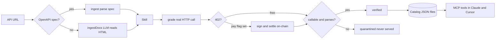
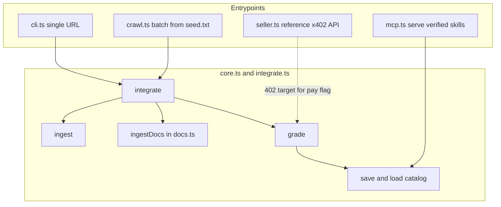
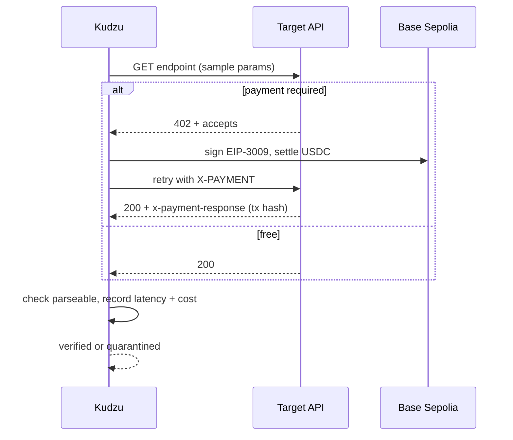

# Kudzu

An autonomous crawler and integration engine that ingests, grades, and monetizes the API internet.
Give it a URL. It returns a live, callable, graded, payable MCP tool. No engineer onboards it.

## High-level pipeline



Three phases: ingestion, verification and grading, exposure and monetization.

## Component map



## Grade sequence



## Run

```bash
npm install
npm run kudzu -- https://petstore3.swagger.io/api/v3/openapi.json   # spec URL
npm run kudzu -- https://www.thecocktaildb.com/api.php              # docs page (LLM fallback)
npm run crawl                                                       # batch from fixtures/seed.txt
npm run run-catalog                                                # call every verified skill in catalog/ live
npm run mcp                                                         # serve verified skills over MCP (stdio)
npm run demo                                                        # assert-based self-check
```

Real x402 payment (testnet, free):

```bash
export KUDZU_PRIVATE_KEY=0x...      # Base Sepolia key, USDC from faucet.circle.com
export KUDZU_NETWORK=base-sepolia   # both read from .env
npm run seller                      # terminal 1: an x402-gated API
npm run kudzu -- fixtures/paid.json --pay   # terminal 2: 402, sign, settle, 200 + basescan tx
```

Docs-only fallback uses the Vercel AI Gateway (OpenAI-compatible):

```
AI_GATEWAY_API_KEY=vck_...
ANTHROPIC_MODEL=anthropic/claude-haiku-4.5   # optional default; use sonnet for hardest docs
```

## Core concepts

| Concept | What it is |
|---|---|
| Skill | Normalized API endpoint: base URL, method, path, params, auth, output type |
| Grade Card | Result of a real probe: status, latency, HTTP code, parseable, cost, settled tx |
| Catalog | Folder of JSON files, one per Skill. The database is the filesystem |
| Integration | ingest (spec) or ingestDocs (LLM) plus grade, producing a verified Skill |

The MCP server serves only verified Skills. Quarantined ones are never exposed.

## Deliberately skipped

- No crawler swarm, DB, queue, dashboard, or auth vault. A folder of JSON is the catalog.
- GET-only, cheapest-endpoint heuristic. Score all ops when a spec's best endpoint is not a GET.
